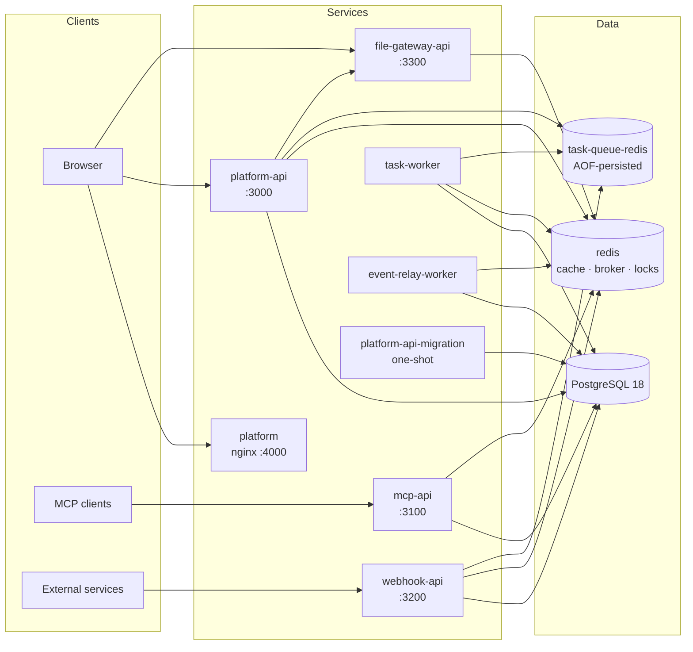

# Architecture

This document maps the critical points of the BlockNext monorepo — what runs, how the pieces talk to each other, and the design decisions behind them. For module-level detail, follow the links into each app's own READMEs.

## System overview



All services ship as containers (Go binaries on distroless, UI on nginx-unprivileged), published to `ghcr.io/blocknextai` as multi-arch (amd64/arm64) images on every release.

## Repository layout

```
apps/
├── platform-api/       # Go modular monolith — 6 binaries (see below)
├── file-gateway-api/   # Go file upload/download service
└── platform/           # React SPA (workflow canvas UI)
packages/
└── go-packages/        # Shared Go library (errors, db, cache, http, jwt, ...)
docker/                 # Per-app Dockerfiles (api / worker / migration / nginx)
scripts/                # Everything the Makefile proxies to
docker-compose.prod.yml # Pulls published images (make docker-up)
docker-compose.local.yml# Builds from source (make local-docker-up)
.env.example            # Single root env file for the whole stack
```

Go apps are stitched together with a `go.work` workspace plus a `replace` directive in each app's `go.mod` pointing at `packages/go-packages` — nothing is fetched from a registry. The JS side uses Bun workspaces with Turborepo.

## platform-api — a modular monolith

One codebase, six entry points. Each binary assembles only the modules it needs via `internal/bootstrap/` (plain constructor injection — no DI framework):

| Binary | Role |
| --- | --- |
| `platform-api` | Main HTTP/WebSocket API |
| `mcp-api` | Exposes workflow nodes as MCP tools, API-key gated |
| `webhook-api` | Inbound edge for workflow trigger webhooks |
| `task-worker` | Consumes queued workflow tasks (queue mode only) |
| `event-relay-worker` | Drains the transactional outbox out-of-process |
| `platform-api-migration` | One-shot migration runner |

**Bounded contexts.** `internal/` holds ~24 modules (workflows, nodeengine, taskrunner, triggers, executions, credentials, account, organizations, ...), each with DDD layering (`application/`, `domain/`, `infrastructure/`, `presentation/`). The full module map with a dependency diagram lives in [`apps/platform-api/internal/README.md`](apps/platform-api/internal/README.md).

Two boundary rules keep the monolith modular:
- Modules never share repositories — cross-module access goes through **service interfaces** injected in `bootstrap`.
- A module's routes, handlers, and persistence live entirely inside its own directory; `module.go` is the only wiring surface.

**Two-layer eventing.** Server→server events use the `eventbus` module: a transactional outbox in Postgres, drained with `SKIP LOCKED` by the relay (embedded in `platform-api` or standalone as `event-relay-worker`). Server→client updates use `realtime`: ephemeral Redis pub/sub broadcast into the `ws` hub. Durability and fan-out are deliberately separate concerns.

**Task runner.** Workflow executions run through `taskrunner` in one of two modes (`TASK_RUNNER_MODE`): `embedded` (inside platform-api) or `queue` (Redis Streams + consumer group, consumed by `task-worker`). Leader election and concurrency semaphores live in Redis DB 1.

**Persistence.** `database/sql` + `lib/pq` — no ORM. Shared helpers (`TransactionManager`, `BaseRepository`, generic scanners) come from `go-packages/database`. Migrations are **centralized in platform-api**: each module owns its `infrastructure/database/migrations/` directory and a dedicated `<module>_migrations` tracking table; the one-shot migration container runs before the stack starts.

## file-gateway-api

A small, focused service: every upload endpoint is gated by a pre-declared `UploadRule` (max size, MIME whitelist, target folder, public/private, filename override) — there is no free-form upload. Storage is pluggable (local disk by default, S3-compatible, Bunny.net). Callers authenticate with a service key (server-to-server) or a short-lived JWT minted at `/auth/token`. It also proxies remote-URL downloads with size/timeout/redirect limits. See [`apps/file-gateway-api/README.md`](apps/file-gateway-api/README.md).

## platform — the web UI

React 19 + Vite SPA. Every feature pairs an API service with a `use-<feature>` hook that owns its state — pages stay stateless. The workflow canvas is React Flow (`@xyflow/react`).

Environment values are injected at **runtime**, not build time: the nginx entrypoint writes `env.js` (`window.__ENV__`) from container env vars, so one image serves every environment. `src/lib/config.ts` is the single access point (falls back to `import.meta.env` in dev).

## Configuration

One `.env` at the repo root feeds the entire stack (Docker Compose interpolates it in file order, so derived values chain: ports → base URLs → callback/CORS URLs). `make setup` generates it from `.env.example`, replacing `REPLACE_ME_OPENSSL_*` placeholders with generated secrets. Defaults are local-friendly: log email sender, local file storage, AI generation features off.

Service ports are fixed (`3000/3100/3200/3300/4000`); container-to-container URLs (e.g. `FILE_GATEWAY_BASE_URL`) use service names on the compose network, browser-facing URLs use `localhost`.

## CI/CD

- **`lint.yml`** — on every push/PR: `golangci-lint` across the three Go modules + ESLint for the UI.
- **`release.yml`** — on release publish: builds and pushes all 8 images (multi-arch) to `ghcr.io/blocknextai`, tagged `latest` + the release tag.

## Design decisions

- **Modular monolith over microservices** — one database, one deploy unit set, hard module boundaries enforced by convention (service interfaces only, no shared repositories). Scale comes from splitting *binaries*, not codebases.
- **Transactional outbox** for anything that must not be lost; plain pub/sub for anything that may be.
- **Opinionated workflow model** — no loops, no sub-workflows, no expression language. Flows stay simple, readable, and predictable for non-developer users; that constraint is a feature.
- **stdlib-first Go** — `log/slog`, `database/sql`, small focused packages in `go-packages` instead of frameworks.
- **Runtime env for the UI** — one image per release, environment decided at container start.
- **Distroless + unprivileged runtimes** — minimal attack surface; health is probed via `/livez` and `/readyz` on every API.

## Deep dives

The mechanics behind the headline features are documented next to the code:

| Topic | Where |
| --- | --- |
| The canvas model — `$references`, credential references, deliberate simplicity | [`workflows`](apps/platform-api/internal/workflows/README.md) |
| AI workflow generation from chat (SSE streaming) | [`workflows`](apps/platform-api/internal/workflows/README.md) |
| One node descriptor → UI form, validation, function calling, MCP tool | [`nodeengine`](apps/platform-api/internal/nodeengine/README.md) |
| How a node becomes an MCP tool | [`mcp`](apps/platform-api/internal/mcp/README.md) |
| Task scheduling, DAG execution order, prompt layering | [`taskrunner`](apps/platform-api/internal/taskrunner/README.md) |
| Trigger types, webhook adapters, runtime config overlay | [`triggers`](apps/platform-api/internal/triggers/README.md) |
| Credential encryption, masking, owner scoping | [`credentials`](apps/platform-api/internal/credentials/README.md) |
| OAuth flow, single-flight token refresh | [`credentialoauth`](apps/platform-api/internal/credentialoauth/README.md) |
| Auth methods & account security model | [`account`](apps/platform-api/internal/account/README.md) |
