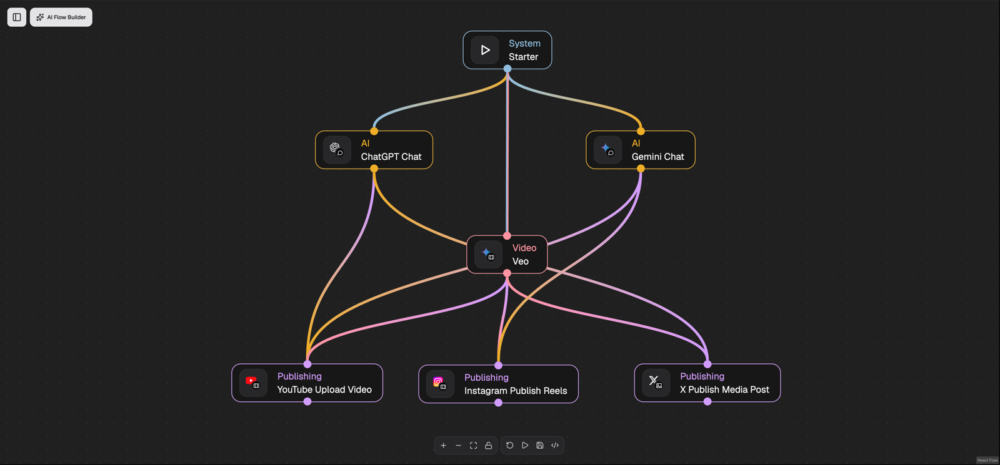

# BlockNext

BlockNext is a no-code platform for building and running AI-powered workflows. Design flows on a drag-and-drop canvas, connect AI models and third-party services, and let your automations run — no code required.

It is built for end users, not just developers: flows stay simple, readable and predictable by design.



*Two models write the copy, Veo renders the video, and the result goes out to YouTube, Instagram and X — one flow, no code.*

## Highlights

- **Visual flow builder** — compose workflows on an intuitive drag-and-drop canvas. Nodes take arrays in and return arrays out, so a node fed ten items runs ten times and emits ten results — batch work needs no loop construct. What is missing is deliberate: no `while`/`for` on the canvas, no sub-workflows, no expression language to learn.
- **Describe it, don't configure it** — give a node plain-language instructions and an LLM fills in its parameters at run time. Anything you set explicitly always wins over what the model infers. This one and flow generation are the only features that need a key of your own (Gemini); both are off by default. Everything else — the canvas, triggers, the MCP server, every integration node — works on a fresh install.
- **Built-in MCP server** — every integration node doubles as an [MCP](https://modelcontextprotocol.io) tool. Point Claude (or any MCP client) at your BlockNext server with an API key and use your connected services from chat.
- **AI-powered nodes** — LLMs and generative AI (text, image, audio, video) as first-class building blocks, alongside integrations for the tools you already use.
- **Async done right** — long-running AI jobs (video, music generation) are a single node. The node starts the job, polls the provider, and returns the finished result — no wait/check/loop scaffolding on your canvas.
- **Featherweight self-hosting** — Go services on distroless images (15–32 MB each). A fresh install runs **7 containers and no Redis**, idling around 100 MB of RAM — PostgreSQL is nearly half of that. Runs comfortably on the smallest VPS.
- **Scale when you need to, not before** — the cache, realtime broker, leader election, concurrency semaphore and task runner all default to in-process providers. Point them at Redis when you run more than one instance; Compose starts a backing service only once something is configured to use it.
- **Triggers** — start flows manually, on a schedule, or from the outside via webhooks and API calls.
- **Live execution view** — watch every task and node progress in real time over WebSocket.
- **Credentials management** — encrypted at rest, OAuth tokens auto-refreshed, and only ever decrypted at execution time — flows never embed secrets.

Curious how it works under the hood? See the [architecture overview](ARCHITECTURE.md).

## Getting started

Docker is the only prerequisite — Go and Bun are needed just for
[development](.github/CONTRIBUTING.md). `make` is a convenience: its targets are thin
wrappers, so every step below is also given without it.

```bash
git clone https://github.com/blocknextai/blocknext.git
cd blocknext
```

### Linux & macOS

```bash
make setup      # creates .env with generated secrets
make docker-up  # pulls the published images and starts the full stack
```

Without `make` — on macOS it arrives with the Xcode command line tools, so a fresh
machine may not have it:

```bash
./scripts/setup.sh
docker compose -f docker-compose.prod.yml up -d
```

### Windows

Docker Desktop installs a WSL 2 backend, and a WSL shell has `make` — open one and
follow the steps above. To stay in PowerShell, use the PowerShell setup script:

```powershell
powershell -ExecutionPolicy Bypass -File scripts\setup.ps1
docker compose -f docker-compose.prod.yml up -d
```

Both setup scripts do the same thing: copy `.env.example` to `.env` and give each
`REPLACE_ME_OPENSSL_*` placeholder its own generated secret. An existing `.env` is
left untouched.

The UI is served on http://localhost:4000. Run `make help` for every target.

One thing to know on a fresh install: `EMAIL_SENDER_PROVIDER` defaults to `log`, so
every outbound mail is printed instead of sent. Signing up with a password does not
wait for verification — you land in the app straight away — but magic-link sign-in and
password reset need the link, and it is in the container logs. Point the sender at
SMTP, Resend or SendGrid when you have credentials.

To build and run everything from source instead, see
[CONTRIBUTING.md](.github/CONTRIBUTING.md) — the development workflow uses
`make docker-dev-up`.

## Upgrading

Set `BLOCKNEXT_VERSION` in `.env` to the release you want (it defaults to `latest`),
then:

```bash
make docker-pull
make docker-up
```

Or, without `make`:

```bash
docker compose -f docker-compose.prod.yml pull
docker compose -f docker-compose.prod.yml up -d
```

Migrations run in their own container before the services start, so schema changes
are applied for you.

## Community

- [Architecture overview](ARCHITECTURE.md)
- [Contributing guide](.github/CONTRIBUTING.md)
- [Code of Conduct](.github/CODE_OF_CONDUCT.md)
- [Security policy](.github/SECURITY.md) — please report vulnerabilities privately

## License

BlockNext is licensed under the [Apache License 2.0](LICENSE).
